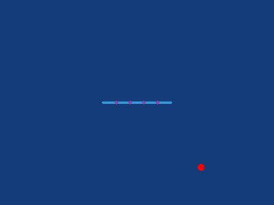

# drl_swimmer

A 2D physics-based environment where articulated creatures made of line segments learn to swim and hunt randomly placed prey using Deep Reinforcement Learning.

  

`/physics` contains simu.py with the class SwimmerEnv that creates all the simulation, the rendering and the rewarding function.

`/learner` contains agents.py that has class Actor and Critic to create both neural networks.

`main.py` launches the PPO training loop with chosen hyperparameters and creature's parameters (number of segments and length of segments), it automatically saves .pth files for actor's and critic's neural networks.

`play.py` replays a trained actor from a .pth file.

Reward function was chronologically:
- distance variation to prey and a bonus if it was touching the prey (the prey is then replaced randomly)
- same but normalised and bonus reward reduced
- normalized velocity toward the prey minus a 0.02 malus each step so that a fixed creature has a negative reward
